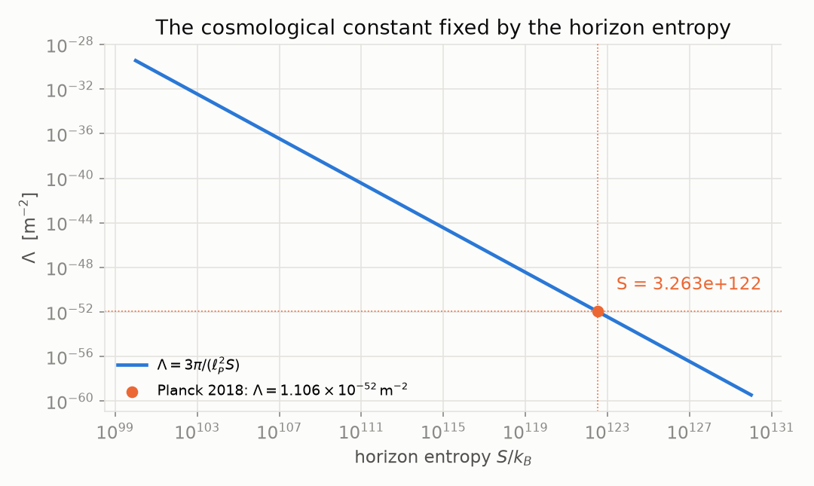
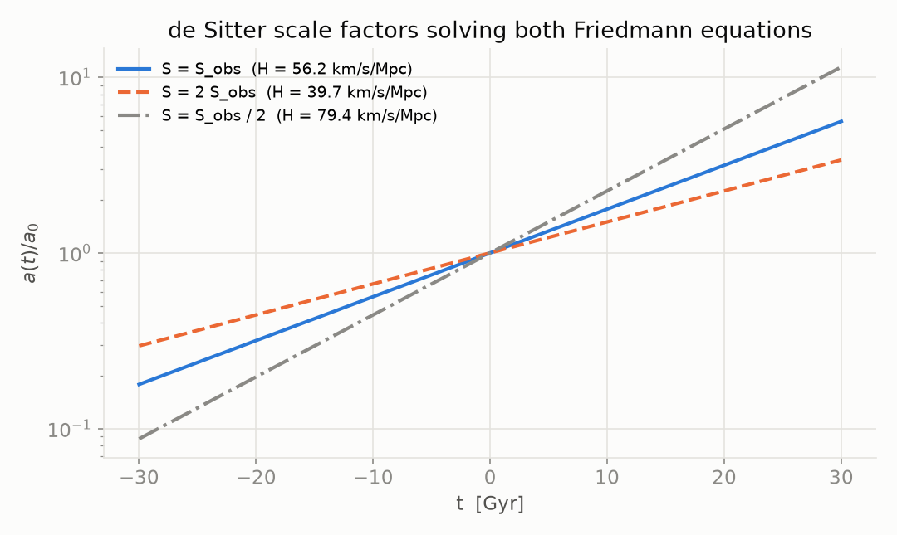
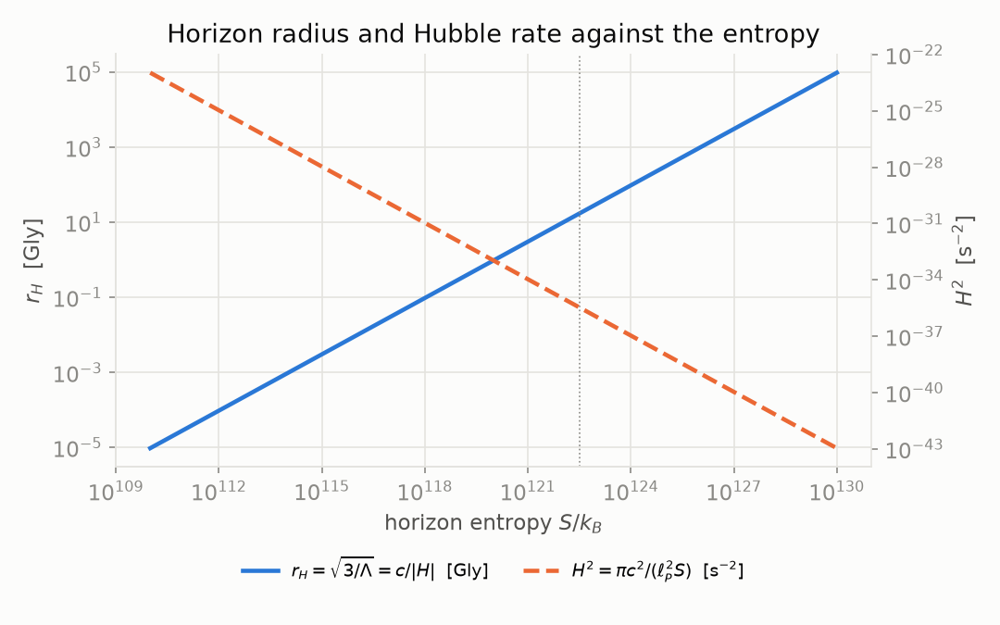

# NRS³ · de Sitter

The cosmological constant as a count, in Lean 4. A de Sitter universe has a horizon of radius
`r_H = √(3/Λ) = c/|H|` and area `A = 12π/Λ`. Its entropy `S = A / (4 ℓ_P²)` fixes the constant:
**`Λ = 3π / (ℓ_P² S)`**. For every `S > 0` this `Λ` gives a solution of both Friedmann equations
whose horizon has entropy exactly `S`, with `H² = π c² / (ℓ_P² S)`. The larger the entropy, the
smaller `Λ`.

**[▶ Try it: move the entropy of the horizon](https://naype888-cloud.github.io/nrs3-de-sitter/)**



## Results

| Statement | Lean |
|---|---|
| `A = 12π/Λ` | `deSitterHorizonArea_eq` |
| `r_H = c / \|H\|` on the de Sitter solution | `deSitterHorizonRadius_eq_div_abs_hubbleConstant` |
| `S = 3π / (ℓ² Λ)`, `0 < S` | `deSitterEntropy_eq`, `deSitterEntropy_pos` |
| `Λ = 3π / (ℓ² S)` | `cosmologicalConstant_eq_of_deSitterEntropy` |
| the constant `3π / (ℓ² S)` has horizon entropy exactly `S` | `deSitterEntropy_entropyCosmologicalConstant` |
| it solves both Friedmann equations (`ρ = 0`, `p = 0`, `k = 0`) | `entropyCosmologicalConstant_firstOrderFriedmann`, `entropyCosmologicalConstant_secondOrderFriedmann` |
| `H² = π c² / (ℓ² S)` | `sq_hubbleConstant_entropyCosmologicalConstant` |
| `Λ` is strictly decreasing in `S` | `entropyCosmologicalConstant_strictAntiOn` |
| the vacuum term of `c⁴/(16πG) (R − 2Λ)` is `R − 6π / (ℓ² S)`; the coefficient of `R` does not depend on `S` | `einsteinHilbertLambdaDensity_entropyCosmologicalConstant` |
| at `R = 0` the density is `−ρ_Λ c²`, with `ρ_Λ c² = Λ c⁴ / (8πG)` | `einsteinHilbertLambdaDensity_zero` |
| `ρ_Λ c² = 3 c⁴ / (8 G ℓ² S)`, strictly decreasing in `S` | `vacuumEnergyDensity_entropyCosmologicalConstant`, `vacuumEnergyDensity_entropyCosmologicalConstant_strictAntiOn` |

In the action `∫ d⁴x e [ c⁴/(16πG) (R − 2Λ) + ψ̄(iħc γ^a e_a^μ ∇_μ − mc²)ψ ]` the entropy enters
only through the vacuum term: `R − 2Λ = R − 6π / (ℓ_P² S)`. The Lagrangian statements are pointwise
in the density; the integral, the curvature of the metric and the Dirac term are not formalized.

### The condition on the state: `det Ω_nrs ≤ det Σ`

The uncertainty condition is not a term of the action: an action is varied over field
configurations, and the inequality restricts the state in which it is evaluated. On the cube
`H_dx ⊗ H_dy ⊗ H_dz`, `Σ(Ψ)` is the `6 × 6` covariance matrix of `(T_x, P_x, T_y, P_y, T_z, P_z)`
and `Ω(Ψ)` the matrix of `½ ⟨i[A, B]⟩`; `Ω_nrs` multiplies the block of each axis by
`C_Nava(d_axis)`.

| Statement | Lean |
|---|---|
| Robertson 1934 on the whole cube, at every state: `det Ω(Ψ) ≤ det Σ(Ψ)` | `robertson_cube` |
| Robertson–Schrödinger on each axis, at every state: `det Ω_axis ≤ det Σ_axis` | `robertson_axis` |
| `Ω(Ψ)` is block diagonal at every state: only `T` and `P` of the same axis collide | `omega_eq_blockDiagonal` |
| at `Ψ* = ψ* ⊗ ψ* ⊗ ψ*`, `Σ(Ψ*)` is block diagonal too | `sigma_psiStar_eq_blockDiagonal` |
| `det Σ(Ψ*) = (C_Nava(dx) C_Nava(dy) C_Nava(dz))² · det Ω(Ψ*)` | `det_sigma_psiStar` |
| `det Σ(Ψ*) = det Ω_nrs(Ψ*)`: the condition holds at `Ψ*` with equality | `det_sigma_psiStar_eq_det_omegaNRS` |
| `det Ω(Ψ*) = det Σ(Ψ*)` with `2` or `3` sites on every axis | `det_omega_eq_det_sigma_psiStar` |
| `det Ω(Ψ*) < det Σ(Ψ*)` as soon as one axis has `4` or more sites | `det_omega_lt_det_sigma_psiStar` |
| at `4 × 4 × 4`: `det Σ(Ψ*) = ((99 − 42√5)/5)³ · det Ω(Ψ*) ≈ 1.0520 · det Ω(Ψ*)` | `det_sigma_psiStar_four` |

`Σ − iΩ` is the Gram matrix of the six fluctuation vectors and `Σ + iΩ` its transpose; both are
positive semidefinite, and that gives `|det Ω| ≤ det Σ` (`abs_det_le_det`).

The Friedmann equations, the de Sitter scale factor `a₀ exp(σ √(Λ/3) c t)` and its Hubble rate
are Physlib's (`Physlib.Cosmology.FLRW`). The length `ℓ` is a parameter: the Planck length in the
figures.



With the observed `Λ = 1.106 × 10⁻⁵² m⁻²` (Planck 2018) the horizon entropy is
`S ≈ 3.26 × 10¹²²`, the horizon radius `17.4 Gly`, and `H = 56.2 km/s/Mpc`, the late-time rate
`H₀ √Ω_Λ` of a universe dominated by `Λ`.



### In NRS³

The de Sitter theorems hold for every `S > 0`; they do not use the pair `T_d : P_d`. The state
condition does: it is the pair `(T_d, P_d)` of each axis of the cube. The relation
`Λ = 3π / (ℓ_P² S)` is an identity for the de Sitter horizon. It becomes a prediction of `Λ` only
when `S = log W` is counted from NRS³ without using `Λ`; that count is not written here.

### History

de Sitter (1917) found the empty universe with a cosmological constant, the same year Einstein
introduced `Λ`. Friedmann (1922) wrote the equations of an expanding universe and Lemaître (1927)
tied them to the recession of galaxies. Boltzmann and Planck (1900–1906) wrote the entropy as
`S = k_B log W`. Gibbons and Hawking (1977) gave the de Sitter horizon the entropy `A / (4 ℓ_P²)`.

## Build

Lean 4 `v4.34.0` and the
[base repository](https://github.com/naype888-cloud/nava-robertson-schrodinger) at `3bb4d4eb`
(it brings [Physlib](https://github.com/leanprover-community/physlib) at `1c81053a` and Mathlib
`v4.34.0`).

```bash
lake exe cache get
lake build
lake env lean Verification/Axioms.lean   # only propext, Classical.choice, Quot.sound
```

Every file: no `sorry`, lines of at most 100 characters, English headers. Figures:
`python3 docs/simulation/figures_de_sitter.py`.

## Timeline 1911–1945

NRS answers a question of the Solvay era with later tools. The series is placed in that window:
what falls inside it is the history the theorem belongs to; what falls after it is a proposal,
not part of NRS³.

| Year | Event | Repository |
|---|---|---|
| 1900–06 | Planck and Boltzmann: `S = k_B log W` | **[`nrs3-de-sitter`](https://github.com/naype888-cloud/nrs3-de-sitter)** (this one) |
| 1911 | First Solvay conference: radiation and the quanta | |
| 1911–12 | Poincaré: Planck's law forces discrete levels | [`nrs3-poincare`](https://github.com/naype888-cloud/nrs3-poincare) |
| 1915–20 | Szegő: limit theorems for Toeplitz matrices (the limit `C∞`, `D8`) | [base repository (NRS, NRS³)](https://github.com/naype888-cloud/nava-robertson-schrodinger) |
| 1917 | Einstein: the cosmological constant; de Sitter: the empty universe with `Λ` | **[`nrs3-de-sitter`](https://github.com/naype888-cloud/nrs3-de-sitter)** (this one) |
| 1922–27 | Friedmann and Lemaître: the expanding universe | **[`nrs3-de-sitter`](https://github.com/naype888-cloud/nrs3-de-sitter)** (this one) |
| 1925–27 | Pauli: exclusion, shells `2n²`, spin matrices | [`nrs3-pauli-dirac`](https://github.com/naype888-cloud/nrs3-pauli-dirac) |
| 1927–32 | von Neumann: the entropy of a quantum state; Klein's inequality (1931) | [`nrs3-landauer-carnot`](https://github.com/naype888-cloud/nrs3-landauer-carnot) |
| 1928 | Dirac: the `4 × 4` gamma matrices | [`nrs3-pauli-dirac`](https://github.com/naype888-cloud/nrs3-pauli-dirac) |
| **1929–30** | **Robertson and Schrödinger: the uncertainty inequality** | **[base repository (NRS, NRS³)](https://github.com/naype888-cloud/nava-robertson-schrodinger)** |
| 1945–46 | Mandelstam–Tamm: the time–energy bound; Rao (1945), Cramér (1946) | [`nrs3-mandelstam-tamm-cramer-rao`](https://github.com/naype888-cloud/nrs3-mandelstam-tamm-cramer-rao) |

**After the window.** Gibbons and Hawking (1977) gave the horizon its entropy. The equations are
de Sitter's and Friedmann's; the entropy reading is later. Lean 4, Mathlib and Physlib are the
verification.

## The mosaic

- [NRS and NRS³ — the base theorem](https://github.com/naype888-cloud/nava-robertson-schrodinger)
- [NRS³ · Mandelstam–Tamm and Cramér–Rao](https://github.com/naype888-cloud/nrs3-mandelstam-tamm-cramer-rao)
- [NRS³ · Landauer and Carnot](https://github.com/naype888-cloud/nrs3-landauer-carnot)
- **[NRS³ · de Sitter](https://github.com/naype888-cloud/nrs3-de-sitter)** (this one)
- [NRS³ · Penrose](https://github.com/naype888-cloud/nrs3-penrose) (proposal)
- [NRS³ · Pauli–Dirac](https://github.com/naype888-cloud/nrs3-pauli-dirac)
- [NRS³ · Poincaré](https://github.com/naype888-cloud/nrs3-poincare)
- [NRS³ · Defect and curvature](https://github.com/naype888-cloud/nrs3-defect-curvature)
- [NRS³ · Rovelli — Loop Quantum Gravity](https://github.com/naype888-cloud/nrs3-rovelli-lqg) (proposal)

## License

NRS Noncommercial License 1.0.0, see [`LICENSE`](LICENSE). Author: Eduardo Nava-Hernandez.
